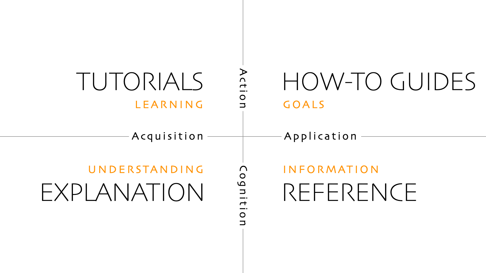

# User Guide

For ICR board members using the platform day to day. Organized by what you need right now:

- **New to the platform?** Start with the tutorial:
  [Your First Meeting](tutorials/your-first-meeting.md) — a guided walkthrough from signing in to
  creating your first meeting.
- **Know the basics, need to do something specific?** How-to guides:
  - [Create, Edit, and Delete Meetings](how-to/create-edit-delete-meetings.md)
  - [Set Up a Recurring Meeting](how-to/set-up-a-recurring-meeting.md)
  - [Suspend and Resume a Meeting](how-to/suspend-and-resume-a-meeting.md)
  - [Navigate and Filter the Calendar](how-to/navigate-and-filter-the-calendar.md)
  - [Export Data](how-to/export-data.md)
  - [Check Backups and Run One](how-to/check-backups-and-run-one.md)
  - [Manage Admin Users](how-to/manage-admin-users.md)
  - [Use Digital Signage](how-to/use-digital-signage.md)
  - [Retry a Failed Sync](how-to/retry-a-failed-sync.md)
- **Need to look something up?** Reference:
  - [Roles and Permissions](reference/roles-and-permissions.md)
  - [Meeting Fields and Modes](reference/meeting-fields-and-modes.md)
  - [Troubleshooting](reference/troubleshooting.md)
  - [Icon and Badge Legend](reference/icon-and-badge-legend.md)
  - [Quick Reference Card](reference/quick-reference-card.md) — printable
- **Want to understand why something works the way it does?** Explanation:
  - [How Calendar and Zoom Sync Work](explanation/how-sync-works.md)
  - [Why Some Actions Can't Be Undone](explanation/why-some-actions-cant-be-undone.md)
  - [Calendar View Behavior](explanation/calendar-view-behavior.md)

This split follows the [Diátaxis](https://diataxis.fr/) system established by primary author Daniele Procida, who originally published his work on [Divio Documentation System](https://documentation.divio.com). This system organizes documentation along two core axes: Action / Cognition axis and Acquisition / Application axis.

*The 2 axes and 4 quadrants of Diátaxis. Source: [https://diataxis.fr/](https://diataxis.fr/)*
