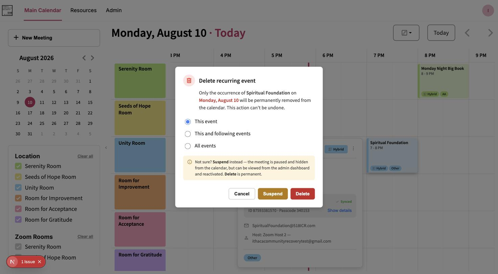

# Create, Edit, and Delete Meetings

## Create a meeting

1. In the left sidebar, click **"+ New Meeting."**
2. Fill in the fields — see [Meeting Fields and Modes](../reference/meeting-fields-and-modes.md)
   for what each one means and which mode requires what.
3. Click **"Create Meeting."**

A success notification confirms the meeting was saved. If it also mentions a Zoom or Calendar
sync problem, see [Retry a Failed Sync](retry-a-failed-sync.md) — the meeting itself is still
saved either way, see [how sync works](../explanation/how-sync-works.md) for why.

## Edit a meeting

1. Click the meeting on the calendar to open its detail panel.
2. Click the **⋮** menu → **"Edit."**
3. Change whatever fields need updating, then click **"Update Meeting."**

All fields can be edited, including mode and recurrence. Editing never changes a meeting's Zoom link or passcode; and for the few meetings on a [legacy Zoom link](../explanation/how-sync-works.md#legacy-zoom-links), the Zoom Host field is locked and the Zoom side isn't touched at all.

> [!IMPORTANT]
> For a recurring meeting, editing updates the **entire series** — there's no per-occurrence edit.
> See [why some actions can't be undone](../explanation/why-some-actions-cant-be-undone.md#editing-recurring-series)
> for the reasoning and the workaround if only one date needs to differ.

## Double-booking a room, Zoom room, or Zoom host

The platform won't silently let you book something already taken, but it also won't block you
outright — if the room, Zoom room, or Zoom host you picked conflicts with an existing meeting at
an overlapping time, a **Scheduling conflict** dialog appears when you click Create/Update
Meeting, listing what it conflicts with. You can **Save anyway** (the double-booking is allowed,
deliberately — this is a "warn, don't block" system, not a hard restriction) or **Go back** to
change the room, Zoom room, host, or time.

## Delete a meeting

1. Click the meeting to open its detail panel.
2. Click **⋮** → **"Delete."**

**Non-recurring:** a confirmation dialog appears — "Delete this meeting? ... This can't be
undone." It also offers **Suspend** right there as an alternative (hides the meeting instead of
permanently removing it — see [Suspend and Resume a Meeting](suspend-and-resume-a-meeting.md) for
what suspending does). Click **Delete** to confirm, or **Cancel** to back out.

**Recurring:** a dialog offers three choices instead:

| Option | Effect |
|---|---|
| This event | Deletes only this occurrence; the rest of the series is unaffected |
| This and following events | Deletes this occurrence and everything after it |
| All events | Deletes the entire series |

> [!WARNING]
> Either way, a delete you confirm can't be recovered — see
> [why some actions can't be undone](../explanation/why-some-actions-cant-be-undone.md). If you're
> unsure, Suspend is the safer choice: it hides the meeting without losing any data, and can be
> reversed later.
