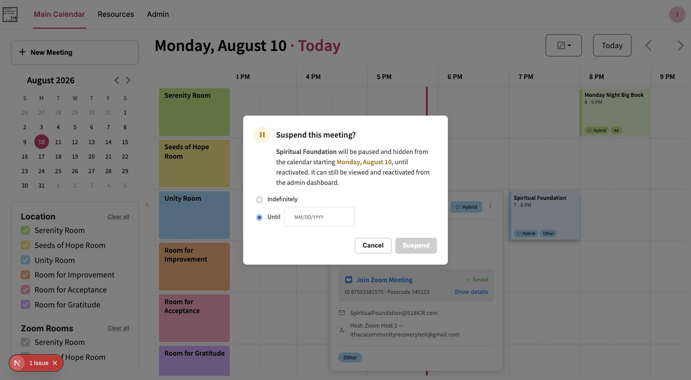

# Suspend and Resume a Meeting

Suspending hides a meeting from the live calendar without deleting it — all its data (Zoom link,
room, recurrence, everything) is preserved, and it can be reactivated at any time. It's the safer
alternative to Delete for anything temporary: a group taking a break, a room unavailable for a
few weeks, a meeting on hold pending a decision.

## Suspend a meeting

1. Click the meeting to open its detail panel.
2. Click **⋮** → **"Suspend."**
3. Choose how long:
   - **Indefinitely** — suspended until someone manually resumes it.
   - **Until [date]** — suspended up to that date, then automatically resumes on its own.
4. Click **Suspend** to confirm.

> [!NOTE]
> For a recurring meeting, suspending from a past occurrence isn't possible — the suspension
> starts today instead, and the dialog tells you this happened.

### What suspending actually does

- Removes the meeting's Google Calendar event(s) — immediately if suspending starts today, or
  scheduled for that future date if you picked a later start.
- **Does not** delete the Zoom meeting or any other data — the meeting still exists, it's just
  hidden from the calendar. Resuming republishes the same Zoom link and details, not a new
  meeting.
- Only Admins and Super Admins can suspend a meeting — see
  [Roles and Permissions](../reference/roles-and-permissions.md).

## Resume a meeting

1. Click the suspended meeting (it won't be on the live calendar — see
   [Checking suspension status](#checking-suspension-status) below to find it).
2. Click **⋮** → **"Reactivate."**
3. Choose when:
   - **Immediately (today)** — back on the calendar right away.
   - **On [date]** — stays suspended until that date, then resumes automatically.
4. Click **Resume** to confirm.

## Cancel a scheduled suspension

If you suspended a meeting for a future date and change your mind before it actually takes
effect, the **⋮** menu shows **"Cancel scheduled suspension"** instead of "Reactivate" (the
meeting is still showing normally on the calendar, so there's nothing to "resume" yet). Choosing
it either cancels the suspension outright or lets you push its end date instead.

## Checking suspension status

A suspended meeting doesn't appear on the live calendar, so you generally won't stumble onto it
by browsing. To find one:

- The **Suspended** card on **Admin → Diagnostics** lists every meeting that's currently suspended or has a
  suspension scheduled for a future date, in one place.
- If you already know which meeting, its detail panel shows the exact status, e.g. *"Suspended
  from July 1, 2026 til August 15, 2026"* or *"Suspends from September 1, 2026, indefinitely"*
  (the second form means it hasn't started yet).

## See also

- [Create, Edit, and Delete Meetings](create-edit-delete-meetings.md) — Suspend is also offered
  as an alternative right inside the Delete confirmation dialog.
- [why some actions can't be undone](../explanation/why-some-actions-cant-be-undone.md) — why
  Suspend, not Delete, is the reversible choice when you're unsure.
