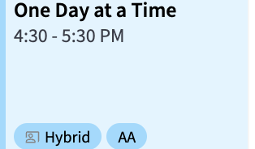
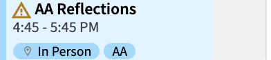
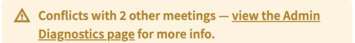
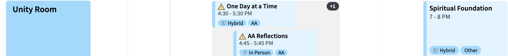
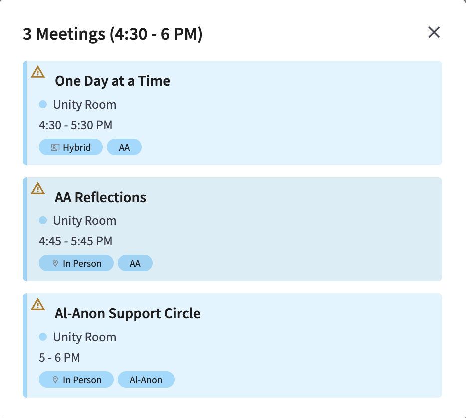
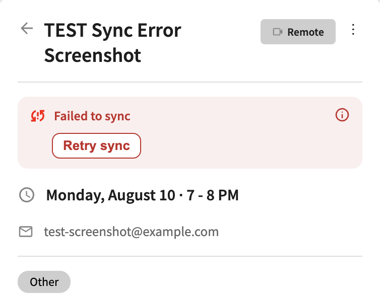
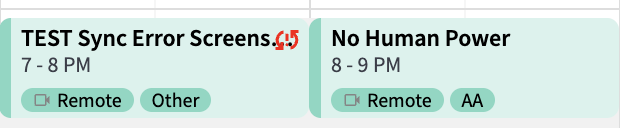
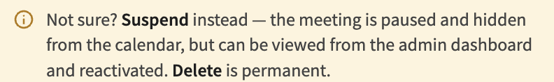
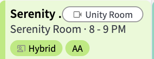
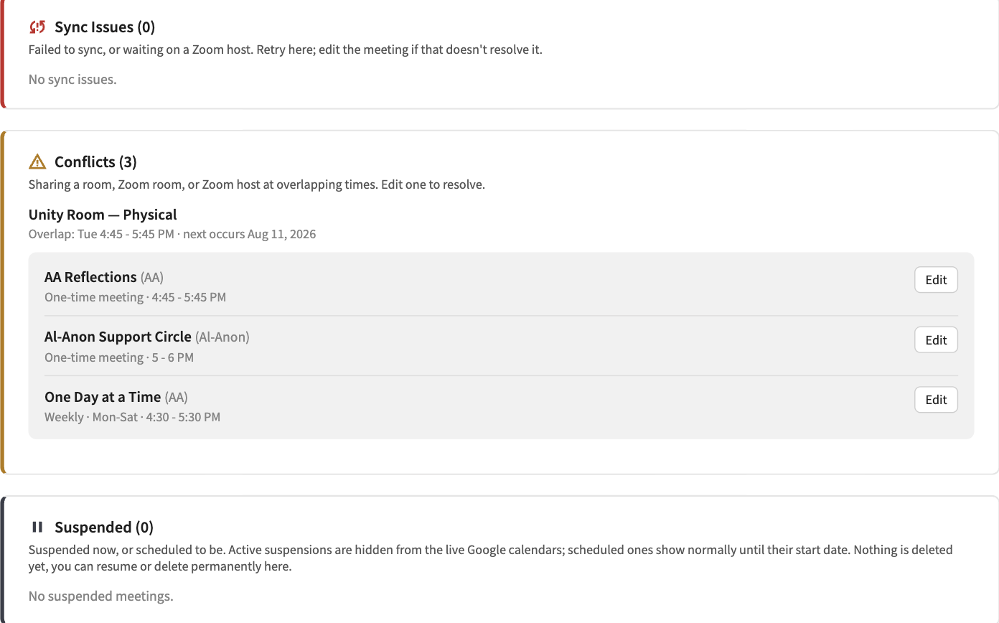

# Icon and Badge Legend

What each icon and badge on the calendar means, and where you'll see it.

**Admin-only:** every icon on this page except the mode icons appears only for signed-in
admins — conflict, sync-failure, and suspension data is never loaded for public viewers.

**Screenshot freshness:** the mode-icon screenshot is current; the other screenshots still show
the app's older icons and need re-capturing by an admin — what each icon means is unchanged.

| Icon | Meaning | Where you'll see it |
|---|---|---|
| Co-present (mode tag) | Meeting is **Hybrid** | Mode picker, calendar tags, detail panel |
| Amber triangle | Room/Zoom room/Zoom host **conflict** | Calendar block (top-left), detail panel, overlap popover |
| "+N" pill (block corner) | Cluster hides N more **overlapping** meetings | Day/Week view, when 2+ meetings share a slot |
| Red broken-ring + "!" | Google Calendar/Zoom **sync failed** | Calendar block (top-right), detail panel |
| Pause (⏸) | Meeting is **suspended** | Suspend dialog, Admin Diagnostics |
| Video icon + room name | Zoom room doesn't match the physical room's default pairing | Calendar block (top-right) |

## Mode icons

Three mode icons: a location pin for **In Person**, a video camera for **Remote**, and this
"co-present" icon for **Hybrid**. The same icon appears in the mode picker and the detail panel.

## Conflict warning

A meeting shares a room, Zoom room, or Zoom host with another meeting at an overlapping time.
Saving isn't blocked, but the warning stays visible to admins until the overlap is resolved.

On the calendar it's a small triangle in the block's **top-left** corner — the sync-error icon
sits in the opposite corner, so a meeting with both shows one in each.

Opening the meeting shows a banner counting its conflicts, linking to **Admin → Diagnostics**
for the full list.

Saving a conflicting meeting brings up this dialog first — save anyway, or go back and change
the room, Zoom room, host, or schedule.

## Overlapping meetings and the "+N" pill

Separate from the conflict warning above — clustering is about layout, not detection. Meetings
cluster when they overlap in time in the same room/column; two meetings that only share a Zoom
host or Zoom room never cluster (different columns) but still conflict.

When more meetings overlap than the view can show (2 on desktop Day/Week, 3 on mobile portrait,
1 on mobile landscape), the visible ones render narrower and a **"+N" pill** appears for the
folded rest.

Only the **pill itself** opens the overlap list — clicking a visible clustered block opens that
meeting's own detail panel, like any other block.

The pill opens a compact popover anchored beside the cluster, titled with the cluster's time
window. Each row carries its own conflict or sync-error marker — clustering together doesn't
mean sharing a status. (Screenshot predates the popover redesign.)

Don't confuse this with the "+N" **inside** a block's tag row — that one summarizes tags that
didn't fit (e.g. `AA +2`), not folded meetings.

## Sync failure

Google Calendar and/or Zoom sync failed for that meeting. The icon is a red broken ring around
an exclamation mark — what other pages call the "⚠ badge" — not the amber conflict triangle; the
two can appear on the same meeting, in opposite corners. The small button next to "Retry sync"
expands a per-service breakdown of what failed. See
[Retry a Failed Sync](../how-to/retry-a-failed-sync.md).

## Suspended meeting

The pause icon marks a meeting that's suspended (or scheduled to be). Suspending hides a meeting
from the live calendar without deleting it. Reactivate from the meeting's **⋮** menu
(**Reactivate**, or **Cancel scheduled suspension** if it hasn't started yet) or from
Admin → Diagnostics. See [Suspend and Resume a Meeting](../how-to/suspend-and-resume-a-meeting.md).

Because deleting is permanent and suspending isn't, the Delete dialog nudges you toward
suspending instead — hidden if the meeting already has a suspension, since a second one isn't
allowed.

## Zoom room mismatch

A Hybrid meeting's Zoom room doesn't match the one normally paired with its physical room. Not
an error — some meetings legitimately differ — but flagged so it isn't mistaken for a data-entry
mistake.

## Admin Diagnostics panel icons

Three of the five Diagnostics summary cards reuse the icons above as headers — Sync Issues,
Conflicts, and Suspended. Each lists every meeting currently in that state; Sync Issues also
covers meetings still waiting on a Zoom host.

