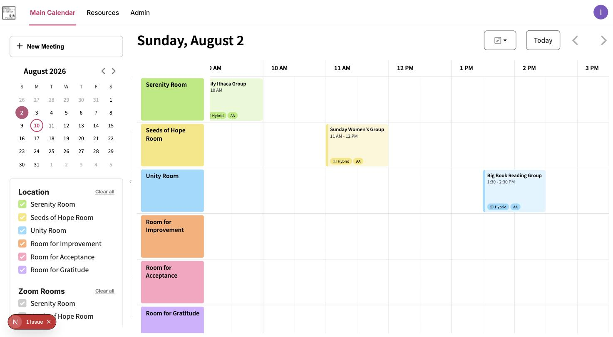
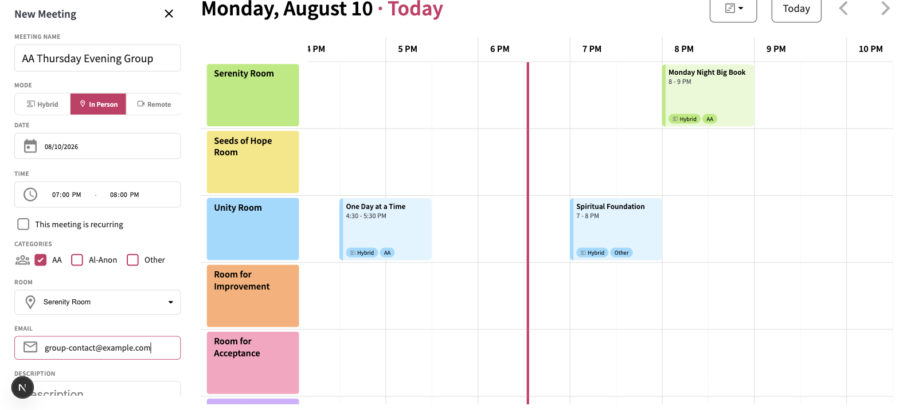
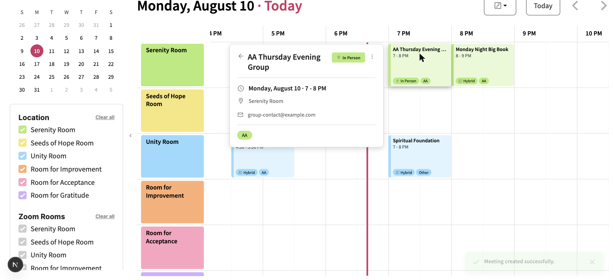
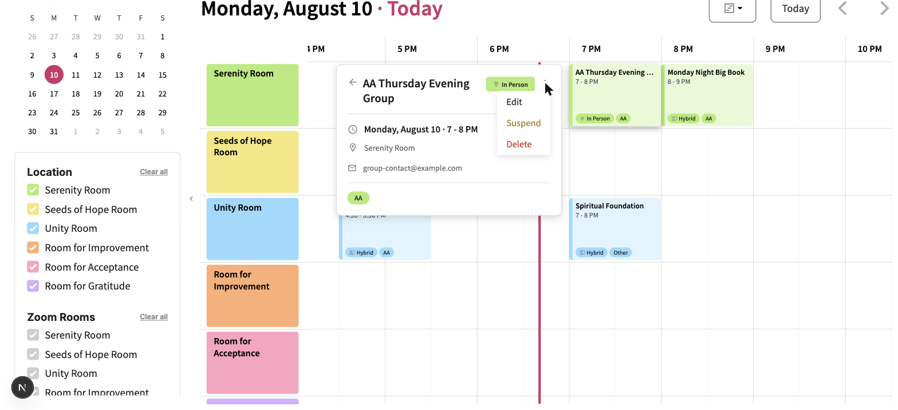

# Your First Meeting

A guided walkthrough for a brand-new board member: sign in, look around the dashboard, create a
meeting, view it, and edit it. By the end you'll have done the core loop once — for everything
else the platform can do, see the [how-to guides](../how-to/).

## 1. Sign in

Go to [`https://ithaca-recovery.vercel.app`](https://ithaca-recovery.vercel.app) and click **Sign In** in the top-right corner. Sign in
with your Google account.

> [!IMPORTANT]
> **First time signing in?** Your email has to be added by a Super Admin *before* you can sign
> in — this doesn't happen automatically just by visiting the site. If you try before that's done,
> you'll land on a generic error page rather than a helpful message. If you're expecting access and this happens, ask
> whoever's onboarding you to check [Manage Admin Users](../how-to/manage-admin-users.md).

## 2. Look around the dashboard

Once signed in, you land on the main calendar. Three areas:

- **Top nav** — Main Calendar, Resources, and Admin (only visible if you have admin access — it's
  hidden entirely otherwise, not shown-but-disabled)
- **Left sidebar** — where you create meetings, navigate dates, and filter what's shown
- **Main calendar** — meetings as time blocks on the selected day or week

The calendar refreshes automatically every 30 seconds.

## 3. Create a meeting

1. Click **"+ New Meeting"** in the left sidebar.
2. Give it a title, e.g. "AA Thursday Evening Group."
3. Pick a mode — **In Person** for now, to keep this first walkthrough simple (Hybrid and Remote
   both involve Zoom — see [Meeting Fields and Modes](../reference/meeting-fields-and-modes.md)
   once you're ready for those).
4. Pick a date and time.
5. Pick a room.
6. Check at least one Meeting Type (AA, Al-Anon, or Other).
7. Fill in a contact email.
8. Click **"Create Meeting."**

You'll see a success notification, and the meeting appears on the calendar right away.

## 4. View it

Click the meeting block you just created. The sidebar switches to a detail panel showing its
title, mode, date/time, sync status, room, and description. Click the **← back arrow** at the top
to return to the main sidebar.

## 5. Edit it

1. With the meeting open, click the **⋮** menu in the top-right of the detail panel.

   
2. Click **"Edit."**
3. Change something — for example, meeting time — and click **"Update Meeting."**

That's the core loop! Have something you want to do in specific? See below:

- [Create, Edit, and Delete Meetings](../how-to/create-edit-delete-meetings.md) — the full
  reference for these three actions, including recurring meetings and deletion options
- [Set Up a Recurring Meeting](../how-to/set-up-a-recurring-meeting.md)
- [Roles and Permissions](../reference/roles-and-permissions.md) — what you can and can't do at
  your current role
